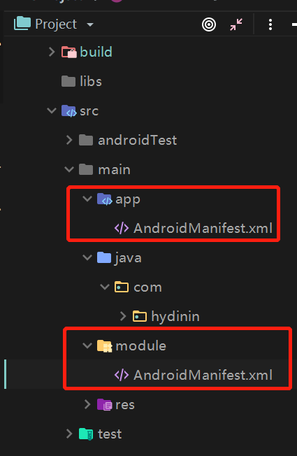
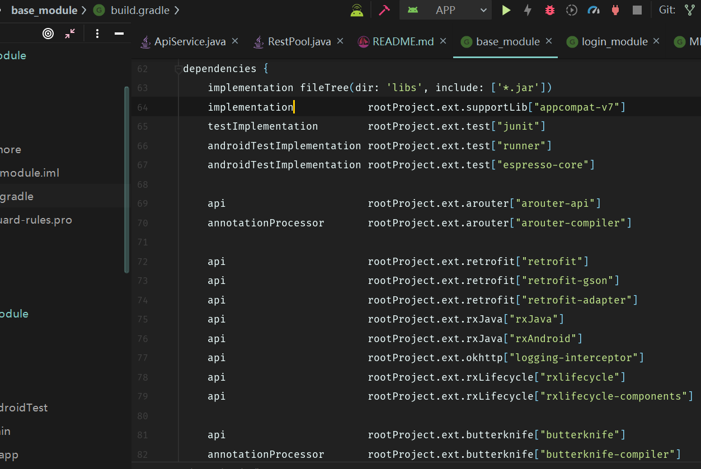

自己写的Android模块化框架，主要里面使用的有模块化，热更新thinker，最新的Android屏幕适配，ConstraintLayout的使用以及RxJava+Retrofit2.0+Butterknife+Picasso等

模块目录大概分类 base_module,login_module,user_module

base_module:主要用基础类，如存放网络请求，图片请求库，工具类等

login_module:主要登录模块 user_module:用户模块 app：主模块

mvp模式的引用：具体使用可以看图片中所对应的java代码

热更新thinker ：我使用的**enableProxyApplication = true **的情况
具体使用详见bugly中tinker以下链接:

https://bugly.qq.com/docs/user-guide/instruction-manual-android-hotfix/#enableproxyapplication-true

Android屏幕适配  使用的是 ***屏幕分辨率限定符与 smallestWidth 限定符适配原理***

ConstraintLayout在三个Fragment中使用将其一些属性以及链的使用如下图：

  

模块化的一些配置：

首先在gradle.properties中添加 **isModule=false**

然后在每个module（app,login_module,user_module，base_module）中的build.gradle中添加

<pre name = "code" class = "java">
  if(isModule.toBoolean()){
      apply plugin: 'com.android.application'
  }else {
      apply plugin: 'com.android.library'
  }
</pre>

<pre name = "code" class = "java">
 javaCompileOptions {
             annotationProcessorOptions {
                 arguments = [AROUTER_MODULE_NAME: project.getName()]
             }
         }
 
         sourceSets {
             main {
                 if (isModule.toBoolean()) {
                     manifest.srcFile 'src/main/app/AndroidManifest.xml'
                 } else {
                     manifest.srcFile 'src/main/module/AndroidManifest.xml'
                 }
             }
         }
</pre>

在每个module中加入两个AndroidManifest.xml,一个是module清单文件，一个是作为主app清单文件

config.gradle：将其所有的依赖放到一起，然后在build.gradle中apply from:"config.gradle"引入

关于build.gradle 中api和implementation

implementation就是使用了该命令编译的依赖，它仅仅对当前的Moudle提供使用其接口。

api：和以前compile一样，其他moudle如果包含了此moudle就能直接使用其下的接口，不需要在引入。

模块间的跳转用的阿里的ARouter

https://github.com/alibaba/ARouter

