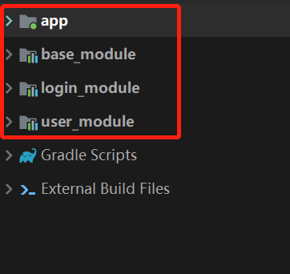
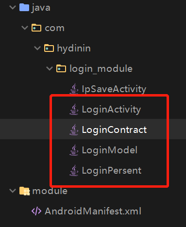
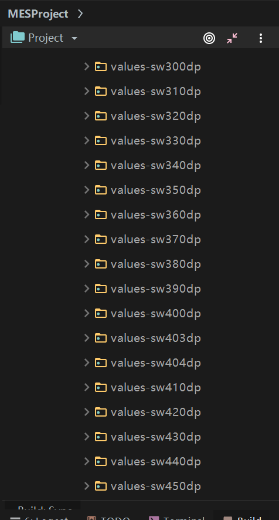
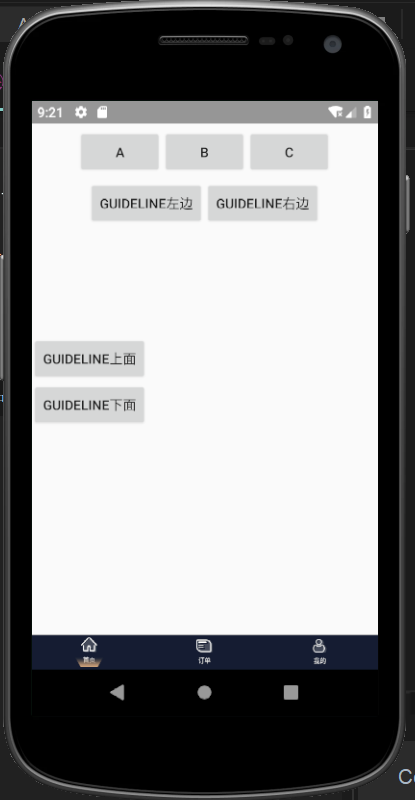
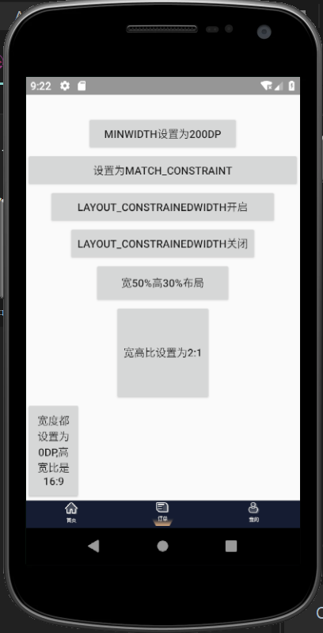
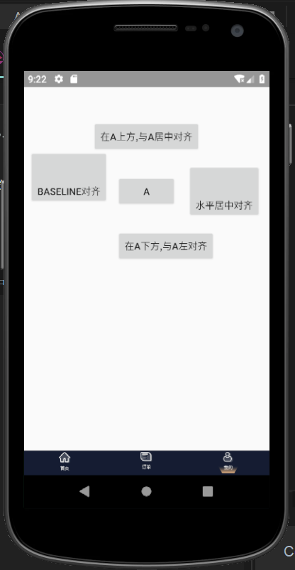

自己写的Android模块化框架，主要里面使用的有模块化，热更新thinker，最新的Android屏幕适配，ConstraintLayout的使用以及RxJava+Retrofit2.0+Butterknife+Picasso等

模块目录大概分类 base_module,login_module,user_module

base_module:主要用基础类，如存放网络请求，图片请求库，工具类等

login_module:主要登录模块 user_module:用户模块 app：主模块

mvp模式的引用：具体使用可以看图片中所对应的java代码

热更新thinker ：我使用的**enableProxyApplication = true **的情况
具体使用详见bugly中tinker以下链接:

https://bugly.qq.com/docs/user-guide/instruction-manual-android-hotfix/#enableproxyapplication-true

Android屏幕适配  使用的是 ***屏幕分辨率限定符与 smallestWidth 限定符适配原理***

ConstraintLayout在三个Fragment中使用将其一些属性以及链的使用如下图：

  

